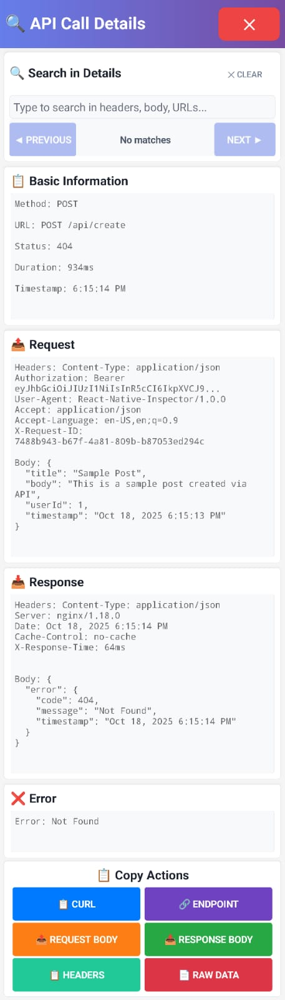

# 🚀 Android SDK 36 Support - v1.0.9

> **Full support for Android 15 (SDK 36) with namespace declaration for modern build tools**

## 📦 What's New

Version 1.0.9 brings essential updates for modern React Native projects using the latest Android SDK and build tools.

### ✨ Key Features

- 📦 **Android SDK 36 Support** - Full compatibility with Android 15
- 🔧 **Namespace Declaration** - Complies with Android Gradle Plugin 8.0+ requirements
- 🔄 **Modern Gradle DSL** - Updated to latest Gradle syntax
- ✅ **Backward Compatible** - Works with all Android SDK versions 21+

## 🎯 Who Should Upgrade

### Must Upgrade If:
- ✅ Using Android SDK 36 (Android 15)
- ✅ Using Android Gradle Plugin 8.0+
- ✅ Seeing namespace-related build warnings
- ✅ Building with latest React Native (0.73+)

### Should Upgrade For:
- ✅ Future-proofing your codebase
- ✅ Latest bug fixes (includes v1.0.8 fixes)
- ✅ Best practices compliance
- ✅ Continued support

## 🔧 What Changed

### Android Build Configuration

**Added namespace declaration:**
```gradle
android {
    namespace "com.reactnativeflipperinspector"
    compileSdk 36
    
    defaultConfig {
        minSdk 21
        targetSdk 36
    }
}
```

**Modernized Gradle API:**
- `compileSdkVersion` → `compileSdk`
- `minSdkVersion` → `minSdk`
- `targetSdkVersion` → `targetSdk`

## 🚀 Installation

### New Installation

```bash
npm install react-native-flipper-inspector@1.0.9
```

### Upgrade from Previous Version

```bash
# npm
npm install react-native-flipper-inspector@1.0.9

# yarn
yarn upgrade react-native-flipper-inspector@1.0.9

# pnpm
pnpm update react-native-flipper-inspector@1.0.9
```

**Then clean and rebuild:**
```bash
cd android && ./gradlew clean && cd ..
npx react-native run-android
```

## ✅ What's Fixed

### v1.0.9 Fixes
- 🔧 Namespace declaration for AGP 8.0+
- 📦 Android SDK 36 (Android 15) support
- 🔄 Modern Gradle DSL syntax
- ✅ Build warnings eliminated

### v1.0.8 Fixes (Included)
- 🐛 "Cannot read property 'method' of undefined" error
- ✅ Variable naming conflict in minified code
- ✅ Enhanced compatibility with older RN versions
- ✅ Improved `globalThis` support

## 📚 Quick Start

```typescript
import { useFlipperInspector } from 'react-native-flipper-inspector';

export default function App() {
  useFlipperInspector(); // ✅ Auto-configured!
  return <YourApp />;
}
```

## 🎁 Features

### 🔍 API Monitoring
- Real-time network request/response capture
- Beautiful floating overlay UI
- Detailed request inspection
- Copy as cURL command

### 📊 State Management
- Redux state tracking
- State change monitoring
- Time-travel debugging

### 📝 Logging & Metrics
- Event logging
- Error tracking
- Performance metrics
- Custom traces

### 🔌 Flipper Integration
- Seamless Flipper desktop integration
- Plugin ecosystem
- Professional debugging tools

## 📸 Screenshots

### Floating Inspector Button


### API Inspector List


### API Details View


### JSON Highlighting


## ✅ Compatibility Matrix

| Component | Supported Versions |
|-----------|-------------------|
| React Native | 0.60+ |
| Android SDK | 21-36 (Android 5.0 - 15) |
| Android Gradle Plugin | 7.0+, 8.0+ |
| iOS | 11.0+ |
| Node.js | 14+ |

## 🧪 Verified Configurations

This release has been tested with:
- ✅ React Native 0.73.2 + Android SDK 36
- ✅ React Native 0.72.x + Android SDK 34
- ✅ Android Gradle Plugin 8.0.1
- ✅ Android Gradle Plugin 7.4.2
- ✅ Gradle 8.0+
- ✅ Physical devices (Pixel 6a)
- ✅ Emulators

## 📖 Documentation

- 📘 [Quick Start Guide](./docs/quick-start.md)
- 📗 [Android Setup](./docs/android-setup.md)
- 📙 [API Reference](./docs/api-reference.md)
- 📕 [Troubleshooting](./docs/troubleshooting.md)
- 📔 [Full Documentation](./README.md)

## 🔍 Verification

Test that everything works after upgrading:

```typescript
import { useFlipperInspector } from 'react-native-flipper-inspector';

function App() {
  useFlipperInspector();
  
  // Test network monitoring
  React.useEffect(() => {
    fetch('https://jsonplaceholder.typicode.com/posts/1')
      .then(res => res.json())
      .then(data => console.log('✅ Network monitoring working!', data))
      .catch(err => console.error('❌ Error:', err));
  }, []);
  
  return <YourApp />;
}
```

**Expected Results:**
- ✅ No namespace warnings
- ✅ No "method property" errors
- ✅ Network requests captured
- ✅ Floating button appears
- ✅ Smooth operation

## 🐛 Known Issues

No known issues at this time.

If you encounter any problems:
1. Clean your build: `cd android && ./gradlew clean`
2. Clear Metro cache: `npx react-native start --reset-cache`
3. Rebuild: `npx react-native run-android`

Still having issues? [Report them here](https://github.com/khokanuzzman/react-native-flipper-inspector/issues)

## 🎯 Migration Guide

### From v1.0.8 → v1.0.9

**No code changes required!** This is a drop-in replacement.

1. Update package: `npm install react-native-flipper-inspector@1.0.9`
2. Clean build: `cd android && ./gradlew clean && cd ..`
3. Rebuild: `npx react-native run-android`

### From v1.0.7 or Earlier

Same as above - update directly to v1.0.9 to get all fixes.

## 📈 Changelog

### Added
- Namespace declaration in Android build.gradle
- Support for Android SDK 36 (Android 15)
- Modern Gradle DSL syntax

### Changed
- Updated `compileSdkVersion` to `compileSdk 36`
- Updated `minSdkVersion` to `minSdk 21`
- Updated `targetSdkVersion` to `targetSdk 36`

### Fixed
- Namespace-related build warnings with AGP 8.0+
- Deprecated Gradle API usage
- Build compatibility with latest Android tools

## 🌟 What's Next

### Planned for Future Releases
- Enhanced UI components
- Performance optimizations
- WebSocket monitoring improvements
- GraphQL support
- Additional network protocols

## 💡 Contributing

We welcome contributions! See [CONTRIBUTING.md](./CONTRIBUTING.md) for details.

## 🙏 Support the Project

If this package helps you, please:
- ⭐ Star the repository
- 🐛 Report bugs
- 💡 Suggest features
- 📖 Improve documentation
- 🔀 Submit pull requests

## 📞 Get Help

- 📖 [Read the Docs](https://github.com/khokanuzzman/react-native-flipper-inspector/tree/main/docs)
- 🐛 [Report Issues](https://github.com/khokanuzzman/react-native-flipper-inspector/issues)
- 💬 [Join Discussions](https://github.com/khokanuzzman/react-native-flipper-inspector/discussions)
- 📧 [Email Support](mailto:khokanuzzman@gmail.com)

## 📜 License

MIT License - see [LICENSE](./LICENSE) for details.

## 🔗 Links

- 📦 [npm Package](https://www.npmjs.com/package/react-native-flipper-inspector)
- 🐙 [GitHub Repository](https://github.com/khokanuzzman/react-native-flipper-inspector)
- 📖 [Documentation](https://github.com/khokanuzzman/react-native-flipper-inspector#readme)
- 🎥 [Video Demo](./screenshots/react-native-flipper-inspector.mp4)

---

**Release Version:** 1.0.9  
**Release Date:** October 21, 2025  
**Download:** `npm install react-native-flipper-inspector@1.0.9`

Thank you for using React Native Flipper Inspector! 🚀

**Happy Debugging!** 🔍✨

