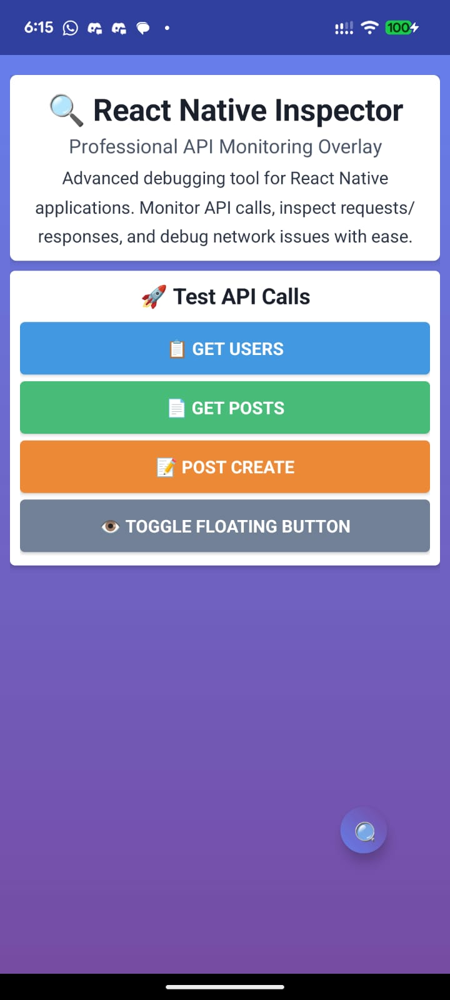

# React Native Flipper Inspector

[](https://github.com/khokanuzzman/react-native-flipper-inspector/actions)
[](https://badge.fury.io/js/react-native-flipper-inspector)
[](https://opensource.org/licenses/MIT)

A production-ready debugging toolkit for React Native apps that integrates seamlessly with Flipper. Provides comprehensive logging, metrics, tracing, state management, and network monitoring capabilities.

## 🚀 Features

- **🔍 Comprehensive Debugging**: Log events, errors, metrics, traces, and state changes
- **🌐 Network Monitoring**: Automatic HTTP request/response capture with privacy controls
- **🔄 Redux Integration**: Built-in Redux store tracking and action logging
- **⚡ Performance Optimized**: Batched messaging and configurable payload limits
- **🛡️ Production Safe**: No-op when Flipper is unavailable, privacy controls included
- **📱 Cross-Platform**: Works on Android and iOS with Hermes enabled/disabled
- **🎨 Beautiful UI**: Intuitive Flipper plugin interface with filtering and export

## 📦 Packages

This monorepo contains:

- **`react-native-flipper-inspector`**: Core React Native library
- **`flipper-plugin-rn-inspector`**: Flipper desktop plugin
- **`example`**: Comprehensive example React Native app

## 🛠️ Installation

### Core Library

```bash
npm add react-native-flipper-inspector
```

### Flipper Plugin

```bash
npm add flipper-plugin-rn-inspector
```

### iOS Setup

Add to your `ios/Podfile`:

```ruby
pod 'react-native-flipper-inspector', :path => '../node_modules/react-native-flipper-inspector'
```

Then run:

```bash
cd ios && pod install
```

### Android Setup

No additional setup required. The library will automatically register with React Native.

## ❤️ Support This Project

If you find React Native Flipper Inspector helpful, please consider supporting its development:

### 💰 Sponsor Now
- **[GitHub Sponsors](https://github.com/sponsors/khokanuzzman)** - Monthly support with perks
- **[Buy Me a Coffee](https://buymeacoffee.com/khokanuzzman)** - One-time donation
- **[Ko-fi](https://ko-fi.com/khokanuzzman)** - Flexible support
- **[Open Collective](https://opencollective.com/react-native-flipper-inspector)** - Community funding

**[👉 Learn more about sponsorship options →](./SPONSOR.md)**

Your support helps us maintain and improve this project! 🙏

## 🚀 Quick Start

```typescript
import { init, log, state, metric, patchNetwork } from 'react-native-flipper-inspector';

// Initialize the inspector
init({
  batch: { intervalMs: 500 },
  tags: { app: 'MyApp' },
});

// Enable network monitoring
const unpatchNetwork = patchNetwork({
  redactHeaders: ['authorization'],
});

// Log events
log('UserLoggedIn', { userId: '123', plan: 'premium' });

// Track metrics
metric('api_response_time', 250, { endpoint: '/users' });

// Update state
state.update('user', { id: '123', name: 'John Doe' });
state.update('session', { isActive: true });
```

## 📖 Documentation

- [**API Reference**](./docs/api-reference.md) - Complete API documentation
- [**Quick Start Guide**](./docs/quick-start.md) - Get up and running quickly
- [**Network Monitoring**](./docs/network-monitoring.md) - HTTP request/response capture
- [**Redux Integration**](./docs/redux-integration.md) - State management tracking
- [**Performance Tips**](./docs/performance.md) - Optimization guidelines
- [**Production Hardening**](./docs/production.md) - Production deployment guide
- [**Troubleshooting**](./docs/troubleshooting.md) - Common issues and solutions

## 🎯 Example App

The example app demonstrates all features:

```bash
cd apps/example
npm install
npm run android  # or npm run ios
```

Open Flipper and look for the "RN Inspector" plugin to see events in real-time!

## 📸 Screenshots

Visual showcase of all features in action:

<div align="center">
  
  
  
</div>

**See more:** [Complete Screenshots Guide](./documentation/screenshots.md)

## 🏗️ Development

### Setup

```bash
# Clone the repository
git clone https://github.com/khokanuzzman/react-native-flipper-inspector.git
cd react-native-flipper-inspector

# Install dependencies
npm install

# Build all packages
npm run build

# Run tests
npm run test

# Lint code
npm run lint
```

### Package Scripts

```bash
# Build specific package
npm -w packages/react-native-flipper-inspector run build
npm -w packages/flipper-plugin-rn-inspector run build

# Run example app
npm -w apps/example start
npm -w apps/example run android
npm -w apps/example run ios

# Development mode
npm -w packages/flipper-plugin-rn-inspector run dev
```

## 🔧 Configuration

### Inspector Config

```typescript
interface InspectorConfig {
  enabled?: boolean;              // default: true in __DEV__
  batch?: {
    intervalMs?: number;          // default: 500
    maxItems?: number;           // default: 50
  };
  tags?: Record<string, string>;  // default tags for every record
  maxPayloadSize?: number;        // default: 10240 (10KB)
  networkEnabled?: boolean;       // default: false
  redactHeaders?: string[];       // headers to redact
  redactBody?: boolean;          // default: false
}
```

### Network Monitoring

```typescript
const unpatch = patchNetwork({
  enabled: true,
  redactHeaders: ['authorization', 'cookie', 'x-api-key'],
  redactBody: false,
});
```

### Redux Integration

```typescript
import { attachRedux } from 'react-native-flipper-inspector';

const unattach = attachRedux(store, {
  whitelist: ['user', 'settings'],  // only track these reducers
  blacklist: ['sensitive'],         // exclude these reducers
  serialize: (state) => state,      // custom serializer
});
```

## 🔒 Privacy & Security

- **Header Redaction**: Automatically redact sensitive headers
- **Body Redaction**: Option to redact request/response bodies
- **Size Limits**: Configurable payload size limits
- **Production Safety**: Automatically disabled in production builds

## 📊 Performance

- **< 10kb gzipped**: Core library size
- **Batched Messaging**: Configurable batching to reduce overhead
- **Tree Shaking**: Unused features automatically excluded
- **No Runtime Cost**: Zero overhead when Flipper is not available

## 🤝 Contributing

We welcome contributions! Please see our [Contributing Guide](./CONTRIBUTING.md) for details.

### Development Workflow

1. Fork the repository
2. Create a feature branch
3. Make your changes
4. Add tests
5. Submit a pull request

### Code Style

- TypeScript strict mode
- ESLint + Prettier
- Conventional commits
- 95%+ test coverage

## 📄 License

MIT License - see [LICENSE](./LICENSE) for details.

## 🙏 Acknowledgments

- [Flipper](https://fbflipper.com/) - The debugging platform that makes this possible
- [React Native](https://reactnative.dev/) - The framework we're built for
- [Zustand](https://github.com/pmndrs/zustand) - State management for the Flipper plugin

## 📞 Support

- [GitHub Issues](https://github.com/khokanuzzman/react-native-flipper-inspector/issues)
- [Discussions](https://github.com/khokanuzzman/react-native-flipper-inspector/discussions)
- [Documentation](./docs/)

---

Made with ❤️ for the React Native community
