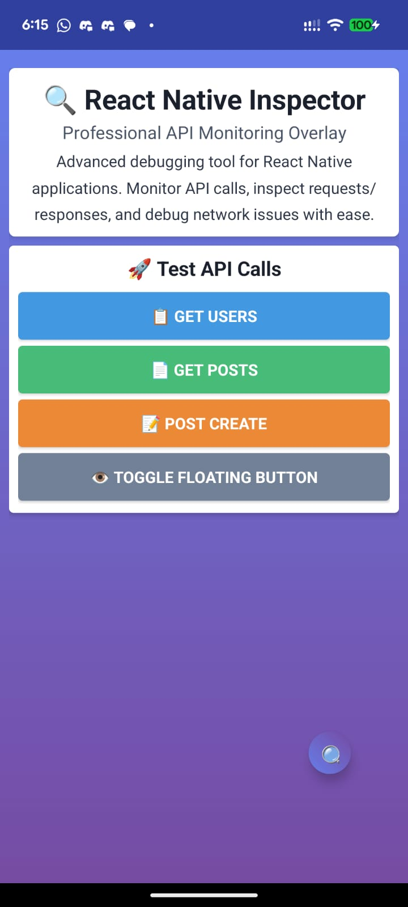

# Quick Start Guide

Get up and running with React Native Flipper Inspector in minutes!

> **🎉 Latest Version: 1.0.8** - Critical bug fix for "method" property error. [See what's new](#whats-new-in-108)

## 📸 Quick Preview

<div align="center">
  
</div>

The floating button appears automatically. Just tap to inspect API calls in real-time!

## Installation

### 1. Install the Package

```bash
npm install react-native-flipper-inspector
```

### 2. Basic Setup (Ultra-Simple)

The simplest way is using the hook:

```typescript
import { useFlipperInspector } from 'react-native-flipper-inspector';

export default function App() {
  useFlipperInspector(); // That's it! 🚀
  return <YourApp />;
}
```

### 3. Start Using It!

```typescript
import { log, error, metric, state } from 'react-native-flipper-inspector';

// Log events
log('UserLoggedIn', { userId: '123', plan: 'premium' });

// Track errors
error('NetworkError', new Error('Failed to fetch'));

// Record metrics
metric('api_response_time', 250, { endpoint: '/users' });

// Manage state
state.update('user', { id: '123', name: 'John Doe' });
```

## What You Get

✅ **Event Logging** - Track user actions and app events  
✅ **Error Tracking** - Capture and visualize errors  
✅ **Metrics** - Monitor performance and timings  
✅ **State Management** - Track state changes  
✅ **Network Monitoring** - See all API calls  
✅ **Beautiful UI** - Integrated Flipper plugin  
✅ **Export** - Export logs as JSON or CSV  

## Platform Support

✅ **Android** - Full support with native overlay  
✅ **iOS** - Full support with React Native UI  

Both platforms have identical feature support!

## Next Steps

- 📖 [API Reference](./api-reference.md) - Complete API documentation
- 🔍 [Network Monitoring](./network-monitoring.md) - HTTP request/response capture
- 🛠️ [Configuration](./configuration.md) - Advanced configuration options
- 🚨 [Troubleshooting](./troubleshooting.md) - Common issues and solutions

## Minimal Example

```typescript
import React from 'react';
import { View, Text, Button } from 'react-native';
import { useFlipperInspector, log } from 'react-native-flipper-inspector';

export default function App() {
  useFlipperInspector();

  return (
    <View>
      <Text>Flipper Inspector Ready!</Text>
      <Button
        title="Log Event"
        onPress={() => log('ButtonPressed', { time: Date.now() })}
      />
    </View>
  );
}
```

That's it! Open Flipper and look for "RN Inspector" plugin. You'll see your events in real-time!

## What's New in 1.0.8

### 🐛 Critical Bug Fix

This version fixes a critical issue that affected older React Native projects:

**Fixed:** "Cannot read property 'method' of undefined" error

**Impact:** 
- ✅ Works with older React Native versions (pre-0.70)
- ✅ No more crashes during network monitoring
- ✅ Improved compatibility across different build configurations
- ✅ Enhanced minification handling

**Upgrade Command:**
```bash
npm install react-native-flipper-inspector@1.0.8
```

**No code changes required!** Just upgrade and everything works. See [Release Notes](../RELEASE_NOTES_v1.0.8.md) for details.
